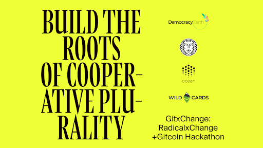

RadicalxChange以其非常规的方式是一个黑客社区。我们坚信市场和民主等无所不在的制度的规则已经过时，我们的使命是揭穿人类合作的“规则”，以揭露我们多元化生活的真正丰富性。

在远离社交的时代，有没有一个比[Gitcoin](https://gitcoin.co/)更好的地方作为黑客社区？无论如何，Gitcoin处于发展和维持开源项目的最前沿。除其他外，[Gitcoin Grants](https://gitcoin.co/grants/)是Quadratic Finance的全球最前沿。

RadicalxChange Foundation与Gitcoin共同推动了[GitxChange](https://gitcoin.co/hackathon/GitxChange/onboard)，这是为期两周的虚拟黑客[马拉松](https://gitcoin.co/hackathon/GitxChange/onboard)，运行时间为2020年5月27日至2020年6月10日。

GitxChange将黑客主义精神与激进的政治经济学相结合。这是一个面向程序员，艺术家，学者，企业家等的开放论坛，聚集在一起交流思想和技术，以建立更美好的社会。

加入我们并获得RadicalxChange概念的第一手经验；在社区中交朋友；并赚一些加密货币。六个赞助商组织提出了令人兴奋的挑战和悬赏。总共有[13项奖品，](https://gitcoin.co/hackathon/GitxChange/?tab=hackathon:13)总奖金为2万美元。

这里有些例子。

* 解决可编程区块链上的双重问题听起来让您兴奋吗？查看[Idena的以太坊接力挑战](https://gitcoin.co/issue/idena-network/idena-go/426/4357)。
* 建立第一个利用[民主地球轨道的](https://gitcoin.co/issue/DemocracyEarth/DemocracyDAO/1/4386)二次投票权的分散自治组织。
* 您是否想出一种允许通配符以最佳方式奖励社区创造的动物艺术品的治理机制？[往这边走](https://gitcoin.co/issue/wildcards-world/ui/93/4375)。
* 您是否认为互联网需要丰富的数据平台？通过《海洋协议》查看[此挑战](https://gitcoin.co/issue/oceanprotocol/ocean-bounties/24/4379)。
* 您是否有与RadicalxChange相关的想法，认为Gitcoin应该集成到其平台中？您可以通过[此链接](https://gitcoin.co/issue/gitcoinco/web/6726/4389)将自己的想法货币化。

最后但并非最不重要的一点是，RadicalxChange基金会邀请您来攻克挑战。一个是关于[为所有权协会中的Quadratic Finance and Voting](https://gitcoin.co/issue/RadicalxChange/GitxChange/1/4381)创建一个[开源软件包](https://gitcoin.co/issue/RadicalxChange/GitxChange/1/4381)。一个示例性的应用是它在房主协会中的使用-管理住房规则并为共享的生活资源筹集资金。

其他三个挑战具有不同的，更具创造性的格式。在这里，我们希望黑客将不到两分钟的视频说明放在一起，分别介绍[数据](https://gitcoin.co/issue/RadicalxChange/GitxChange/4/4384)[拍卖](https://gitcoin.co/issue/RadicalxChange/GitxChange/3/4383)，[二次方融资和投票](https://gitcoin.co/issue/RadicalxChange/GitxChange/2/4382)以及[在拍卖中出售的自我评估许可证](https://gitcoin.co/issue/RadicalxChange/GitxChange/3/4383)。我们希望这些视频能够帮助我们以一种易于理解和有趣的方式将RxC概念传播给更多的观众。

如果您认识任何有才华的编码人员，项目经理或视频制作人，那么如果您将他们带入这些挑战，我们将非常高兴！

此外，我们期待6月19日至21日的虚拟年度会议[RxCon](https://www.radicalxchange.org/2020-conference/)，赞助商将有机会介绍GitxChange的成果并称赞相关的黑客。

让我们一起来参加GitxChange，为合作多元化打下基础！

*非常感谢Gitcoin和Connor O'Day团队，使所有这些成为可能。*