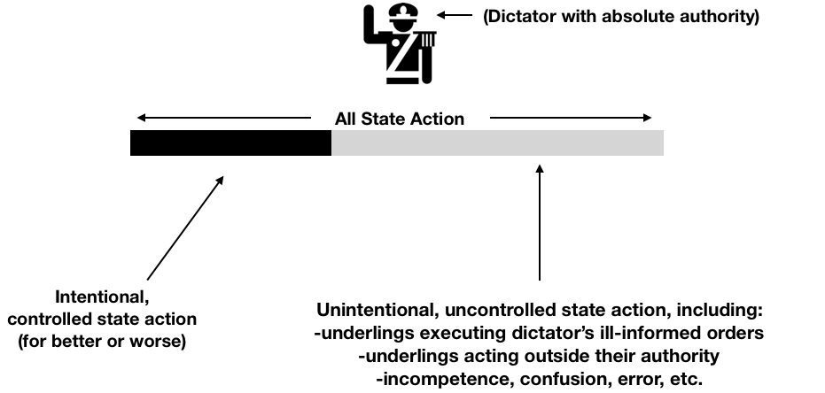
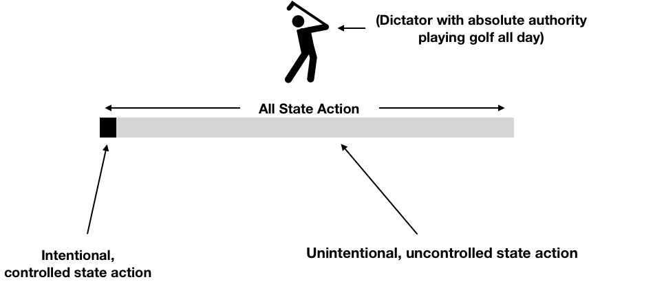
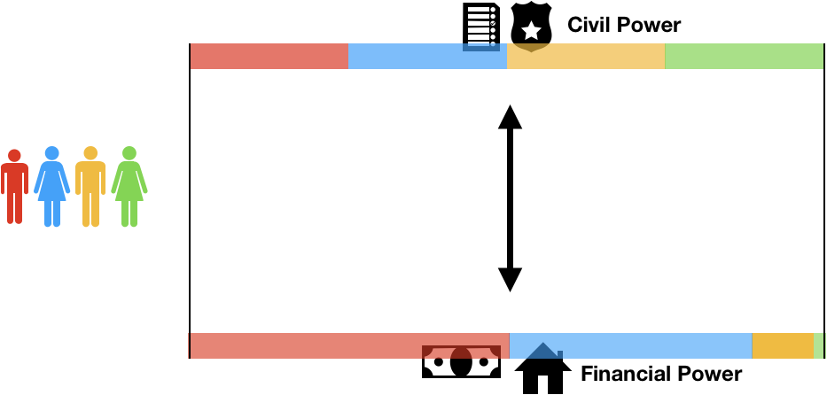
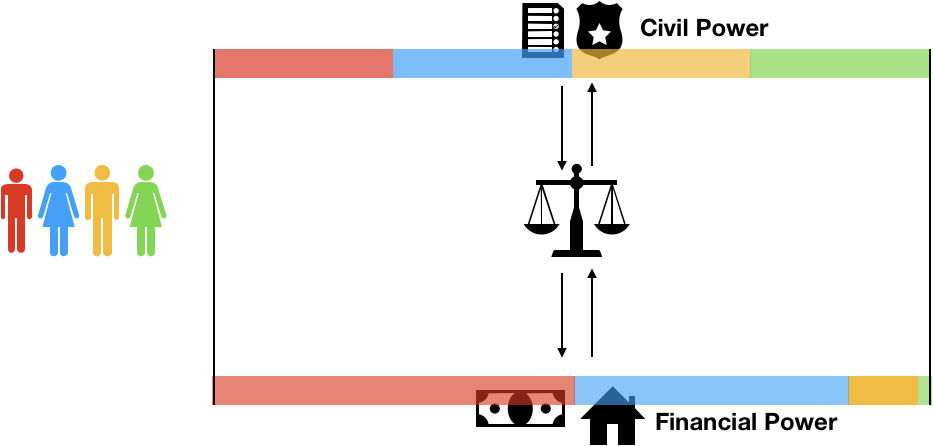
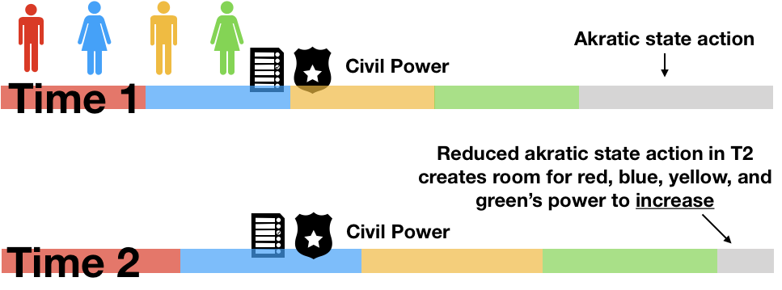
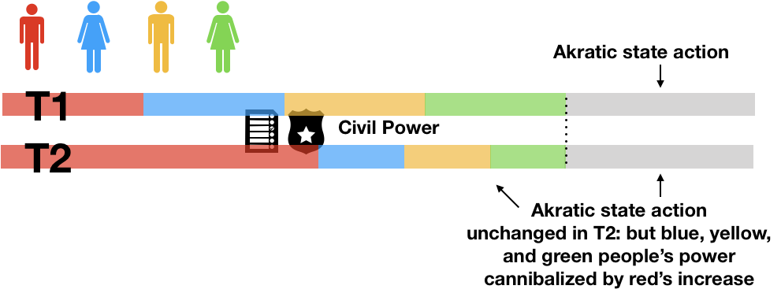
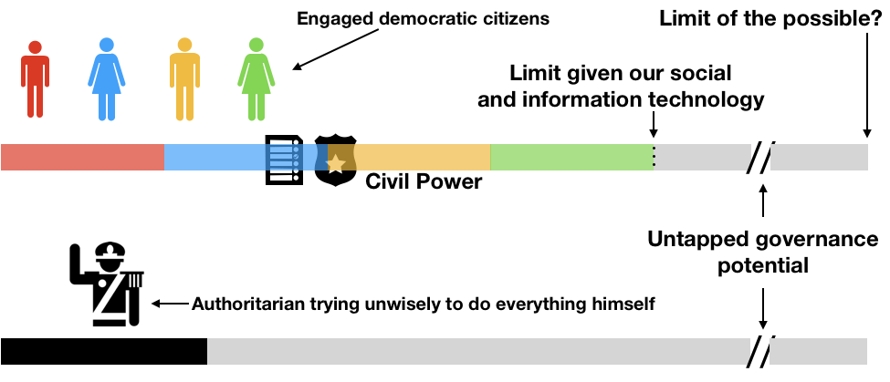
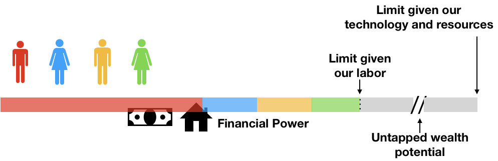
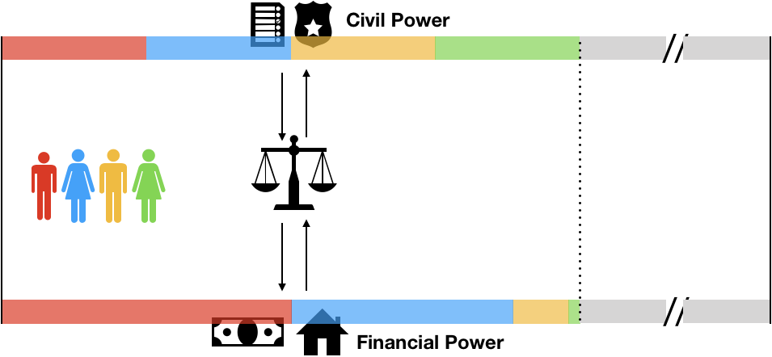

在民主国家，每个公民都享有国家强制力的平等份额。因此，他们有权通过投票平等地控制国家的强制性机构：

但是，同一公民在社会总财富中所享有的份额是不平等的：

拥有资本主义精神的民主国家在这种不匹配中没有什么可担心的。这是从两个广为接受的前提得出的。

* 在不降低他人→资本主义民主制的前提下，任何人对国家的控制都不能增加，前提是“锁定”了人民的公民平等
* 在没有人的财富增长使另一个人更贫穷的前提下→资本主义民主政体使人们在财务上产生分歧

不幸的是，两个前提都是错误的。

## 民权不是零和游戏

让我们从第一个前提开始。

稍微重申一下，它声称存在对状态控制的“固定派”，可以重新分配但不能增加。这是错误：假定对该状态的现有权限\[1]已*被完全行使*。它设想对状态的控制，例如装满边缘的玻璃杯中的水，因此，如果添加了任何东西，则必须减去一些。但事实上，国家部分超出任何人的控制：有了更好的信息，例如，我们可以增加其状态的程度*在转向，任何人* \[2]理论权威的玻璃是从来没有真正充分。

为了说明这一点，假设您是一个绝对的独裁者。在纸面上，您将对国家所做的一切拥有100％的控制权。但现在想象一下实际上是在尝试行使这种控制权。无论您的管理技能多么强大，都会出现滑点。您必须将权力下放给下层分子，下层分子又将其下放给小军队。您可以发出指令，但是指令的准确执行取决于您无法直接监视的代理的努力程度。更糟糕的是，指令的质量取决于提供给您的有缺陷的信息。

因此，尽管您拥有绝对的正式权力-即使您的意图和管理技巧非常出色- 手表上仍会发生大量错误的消息，不受控制或其他[极端的](https://en.wikipedia.org/wiki/Akrasia)政府行为：

\[3]确实，历史上充斥着混乱的独裁统治的例子，这些独裁统治或多或少地不受任何人的控制：

因此，激流行动的幅度代表了民事权力“派”的增长空间。无论是专政还是民主，都是如此。因此，对我们通过投票行使的国家机器的控制不会利用固定和的商品。\[4]

## 完全控制是不可能的

需要强调的是，对状态的“完全控制”始终是嵌合的。独裁者，官僚和民主公民都可以使用它，但永远不会抓住它。这是自然的结果，因为所有人（独裁者，总统，法官，警官和选民）在信息不完善的情况下工作。

有趣的是，极端状态行动源于信息处理缺陷，这一事实意味着民主政体具有内在的优势。因为在民主国家，公民通过从投票箱操纵国家来精确地提供了不可替代的信息。相比之下，即使是一个善良的独裁者也只能猜测他的臣民真正知道和想要什么，因为他的定义是将他们排除在治理之外。因此，通过让所有公民的思想参与治理，民主政体具有（理论上，尽管常常是未实现的）潜力，比专制政体更明智地行使权力。

显然，民主可能会严重失灵，并且在最佳情况下是不完美的。\[5] 民主决策过程需要进行彻底改革（除其他外，必须进行二次表决）。但最终，我相信民主不仅可以在合法性方面而且可以在决策质量和速度方面胜过独裁。

但是我离题了。这里的主要结论是，所有州的特技动作都有问题。这也许令人惊讶，这意味着与经济不同，民权的整个“核心”实际上可以增长。\[6]

## 财富不是无限的游戏

资本主义民主国家的第二个错误前提是，一个人不断增长的财富永远不会使另一个人变得更贫穷。我不想在这个脚踏实地的地面上泼墨，但是我将简要概述我的论点，以表明它如何反映上一点。

在资本主义民主制中，公民权力的平等分配与金融权力的不平等分配处于相互紧张之中。就像电池的两侧存储相反的电荷一样，它们想要均衡。即，富人想利用他们的巨额财富来购买对政府的巨额权力，而穷人则想行使其平等的公民权力，以使他们的财富更接近平均水平。

但是，就像电池一样，这两个分布之间有一个分隔。我们将此分区称为“法律权利”。合法权利限制了每种分配可以影响彼此的程度：

宽松地讲，我们可以说两种不同的合法权利：公民权利和财产权利。公民权利维护了我们平等的公民权力。产权保留了我们不平等的财务权力。还有另一个区别。公民权利是不可出售的或“不可剥夺的”，而财产权则可以出售。

我们通常将产权视为赋予我们对土地，房屋，汽车，金融工具或艺术品之类物体的权力。但是，对产权的看法充其量只能看到硬币的一面。事实是，当我们获得某物件的合法财产权利时，我们与该物件的关系不会改变，但我们与他人的关系却会发生变化：我们能够要求武装警察将其他人带离该物件。因此，就像许多人一样，认为产权只是意味着更多的财富，更多的繁荣，更多的人类对惰性性质的支配，这是一个可怕的错误。产权显然赋予了人类彼此之间的权力。

在这个关头，至关重要的是要探究历史上最黑暗的章节。“权利”作为普通百姓抵制压迫的盾牌的通俗口头说法可追溯到18世纪，当时，民权最终扩展到了世袭贵族以外的其他人。但是，如果民权是现代发明，那么财产权就更古老了。在黑暗时代，它们已经是根深蒂固的地方，在那里，它们是人类自由的坚不可摧的敌人。确实，对于奴役的人民，农奴，失地农民和妇女（也就是说，在我们制定法律的中世纪晚期社会中几乎每个人），财产权都是他们的束缚。他们授权强国对弱者使用暴力。

他们也从未消失。有人可能会争辩说，产权进入现代时代是先决条件，使昔日的封建领主愿意让现代时代发生。

现代财产法打磨了他们丑陋历史的最粗糙的边缘，但是并没有完全消除它。例如，今天的财产权可以转让给任何人，而不仅仅是贵族之间。今天的房东只能在狭窄的情况下（而不是像过去那样在直接和广泛的情况下）通过警察对房客施加暴力。但是它们的基本结构从未改变。迄今为止，了解现代产权的最清晰方法就是将可转让的特权用于将国家的强制性工具用于私人目的。

因此，扩大产权市场是从可怕的封建主义向不那么糟糕的现代性迈出的一步。但是，许多财产（例如人和土地的财产权）仍然是一个完整的文物，在那个时代，权力甚至都没有试图为自己辩护。

如果这仍然是正确的怎么办？政治左翼的许多人看到市场上有些不人道的事情。难道他们看到的不公正实际上与交换无关，而与交换的财产权利有关吗？

财产权的概念是“没人经营，只有所有者拥有”，这是一个浪漫的小说。财富始终取决于社会保护它的意愿，但是在许多情况下，它在同一个社会中具有非凡的强制性。可以肯定的是，产权有时具有积极的外部性，其危害性大于其弊端，但并非总是如此。因此，真正的民主制度不能毫无疑问地承保私有财产。

## 财产有声无息

在质疑财产结构时，我们瞥见了财富积累不是无限和游戏的方式。实际上，政治左翼人士对“市场”感到厌恶的很多东西，显然都被解释为对某些种类的产权的反对。换句话说，问题更多在于“拥有”而不是“交换”。

但是，并非所有拥有，使用，建造和享受的权利都是有害或令人反感的。我们必须能够明确区分生产性财产权和压迫性财产权。

最重要的现代财产理论家约翰·洛克（John Locke）辩称，只有当索赔人“将其劳动”与所要求的财产“混合”时，财产主张才是正当的，即使如此，也仅在所要求的财产“足够而充分”的范围内在公共领域供他人同样主张。这些条件是明智的，它们揭示了在我们网络密集的当代世界中许多财产主张中的缺陷。曼哈顿土地市场上没有所谓的“足够好”了。当技术公司抢占并利用大量用户数据时，他们在对某些事物进行“混合劳动”之前就对某些事物提出了主张，从而不仅损害了用户，而且损害了对该数据具有合法利益的其他方。

简而言之，我称这些“不健全”的产权。不健全的财产权所产生的财富是国家权力的私下争执，因此是最重要的公共问题。这是公共警察权力为自私的私人团体服务的一种选择。

为了进一步说明，假设一个民主国家只是拍卖了其强制性（警察和税收）权力，以便最高出价者可以将其用于私人利益。公民可以生活在新的投资者霸主之下，也可以移民。无论您如何考虑，\[7]这样的国家显然不再是民主国家。而所有不健全的财产权利就是阴影。

总而言之，尽管一个人的财富可以在不损害任何其他人的情况下增长（例如在用劳动换钱时），但这并不总是能够积累财富。不健全的财产权带来的财富是一种强制形式，即公共权力泄漏到私人手中。如果不健全的产权较少（例如，如果更多的产权基于COST或SALSA这样的系统 ，那么财富分配的不平等程度将大大降低）。

## 全部放在一起

当状态随着时间的推移从较少控制变为更多控制时，实际上每个人都有空间同时增加对状态的控制：

这表明民权不是零和博弈。显然，这并不意味着我们可以任意增加一个人的权力，并且期望它不会蚕食他人的权力：

因为每个人的民事权力总和受到我们信息和社会技术的限制。换句话说，只有当我们的治理变得更聪明时，蛋糕才会增长。除非那件事发生，否则我们不能不从保罗手中夺取彼得的权力。

此外，有充分的理由认为，当我们让尽可能多的人参与权力行使时，而不是将其集中在一个人，一个政党或少数寡头上，我们就越接近可能的极限。

总财富也可以增长。但实际上，它也受到我们劳动力，技术和资源的限制。

因为财富不是零和游戏，所以某些人的不寻常财富可能反映了他们对社会的非凡有价值的贡献-例如，特别的努力工作，或者对扩大总可能财富的技术领域的个人贡献。但是，鉴于大多数财富创造过程是深层社会化的，因此在健全的产权世界中，个人财富的集中可能存在限制。相反，我们在我们周围的世界中看到的非同寻常的财富集中度，主要是“不合理的”私有财产索偿的结果-对土地，自然资源和数据之类的事物的影响，这些价值的大部分价值并非来自所有者的贡献，而是来自租用大规模分布的网络效应。

为了解决这些问题，我们必须搁置关于财富的私有性和公民权力的有限性的旧假设。我们需要考虑作为每个人的业务的“私人”财富的来源，我们需要考虑参与性的公民权力，就像经济一样可以发展。

## 彼此具有民事和财政权力

之前，我曾说过，至少在理论上，公民和金融权力受到合法权利的相互影响。概括一下：由于财产权，公民权力可能不会被用来获取他人的财富。而且由于公民权是在出生时就被授予的，并且是不可出售的，因此财富可能不会被用来购买他人的公民权。

但是，当然在现实生活中，这种划分是不断跨越的。例如，累进税代表民权干扰了金融权力。游说，竞选捐款和腐败则相反。

但是，如果我们有一个简单的规则，而不是一个复杂的，具有可渗透性的法律规则网络，该规则如何以私有术语“定价”公共权力；反之亦然？

民主公民对国家施加的控制权汇总为某些公共资源的“供给曲线”。这些“资源”可以通过委托或疏忽产生，例如，建设更多的公共基础设施，或取消对诸如污染等危险活动的法规。

个人的私人需求汇总为该公共资源的“需求曲线”。两者之间的交集提供了民主社会愿意提供的公共资源的数量。

从某种意义上讲，这是二次投票处理的内容：

但是请注意，这是可取的，假定所有个人都有权使用产生这些供求曲线的民事和财务权力。

现在让我们打破这个假设。假设某些事情是基于单方面行动而发生的变化，例如某人投票一次以上。这移动了平衡，改变了所提供的公共资源的数量，从而给整个社会增加了成本。

通过将民权转化为金融权，反之亦然，我们可以清楚地看到该成本的结构不是线性的。它是二次方的，因为给社会造成的“沉重”损失是由三角形的面积给出的，三角形的面积随着个人单方面行为的平方而增加：

但是，如果蓝色选民愿意为社会的二次外部性付钱，无论是金钱还是其他选票，那么我们为什么不应该允许它呢？这种支付将第二次投票从对权力的争夺转化为对权力的公正表达。

当人们利用自己的财富来影响公共行动时，也会出现二次外部性。\[8]如果他们通过腐败，游说或简单的人对人的投票，线性地“购买”了额外的政治权力，那就意味着严重的不公正。但是，如果人们不得不二次支付公众的钱，那么允许人们利用他们的财富来影响公共行动是有道理的，特别是如果财富本身的分配来自“健全的”而不是强制性的财产制度。

当我们抛弃过时的信念，即金融权力完全是私人关注的问题时，这一切都不会那么令人震惊。不是，而且从未如此。选票和美元都代表对国家强制力的要求。它们都印在政府文件上并非偶然。

## 结论

我说过，资本主义民主制有两个前提：

* 任何人对国家的控制都不能增加而又不减少另一人的控制
* 没有人的财富增加会使另一个人变得更贫穷

第一个前提是错误的，因为个人对国家控制的增加可能源于不受控制的或激烈的国家行动的减少，而不是其他民族权力的减少。

第二个前提是错误的，原因有两个。首先，个人财富的增长并不一定总能赚钱，因为它们通常来自寻租或不健全的产权。第二，即使是赚来的财富，如果可以用来以低于二次方的价格购买民权，也会对同胞有害。

因此，让我们对更灵活的系统开放！让我们努力发展民权和经济权；让我们问一个关于金融权力从何而来的难题，就像我们对政治权力从何而来一样。这些是迈向彻底改善政治经济的关键步骤。

\[1]我正在使用权威和控制来表达不同的意思。授权是指“授权的”控制权，即根据法律或其他规范所授予的控制权。控制意味着“施加”控制。例如，如果您在选举日停留在家里，则您将丧失控制权，但没有丧失权力。

\[2]除其他外，这意味着当彼得获得对国家的更多控制权时，我们无法推断出他的权力是从保罗手中夺取的。但这并不是说民主公民对国家权力的控制权平等并不重要。是的，我将回到这一点。目前，重要的是要看到“饼的大小”可以增加。

\[3] [Noun Project的](https://thenounproject.com/) Luis Prado的独裁者图标。

\[4]该商品的数量也不能增加到无限。关键是我们需要避免错误的二分法，一方面是绝对零和的精神笼子，另一方面是无限增长的海市rage楼。两者都是虚幻的。

\[5]同样重要的是要认识到选民行使权力是强制性的。可以肯定的是，民主决策可能是话语，合理和文明的。但是要充分理解民主，就必须瞥见其强制性的一面。

想象一下，两个敌对的将军站在战场的两端。他们的军队已准备好发生冲突，但将军们正透过双筒望远镜凝视着对方的部队。规模较小的将军将放弃白旗，战斗在开始之前就结束了。通过遵循这一程序，胜利将达到最强大的水平，而不会流血。假设士兵们选择了他们的军队，那些将军们刚刚进行了投票。他们之所以屈居多数，并不是因为它是对的，而是因为它确实威胁到了对方。

这种民主观点有助于解释对白人男性土地所有者和其他特权阶级投票的历史限制：这样的人是仅有的具有足够威慑力互相威胁的人。在投票中，他们实质上是“套打”阶级内部的暴力，通过复制其结果避免了进行实际战斗的需要。

每次投票都超出了强制力的字面意义，就构成了道德进步。从贵族到非贵族男人，再到种族和宗教少数派，再到[妇女](https://en.wikipedia.org/wiki/Women%27s_suffrage_in_Switzerland) ，每一步都使我们朝着一种不那么暴力的人类组织方式迈进。但是更大的包容性并不会改变投票的性质：即使是最具有包容性的民主政权，基本上也仍然将每个选民想象成战场上的同等兵力。

\[6]我应该解决一个可能的误解。当我谈到公民的整体权力在总体上提高时，您可能会认为我的意思是国家与公民之间的总体权力平衡正在转向后者。但这不是我的意思。我的意思是，给定固定数量的状态权力，可以增强对该权力的智能控制。换句话说，在不减少国家权力的情况下，可以增加其响应能力，有意性和智慧。如果整个公民的公民权力以这种方式同时增加，那么国家权力的变化将是质的而不是数量的。

\[7]将民主搁置一会儿，请注意，这样做的弊端取决于政权的逃避能力。如果它是一个小的新的特别经济区，那么如果您不喜欢它的系统就很容易避免，那就很好了。但是，如果是整个国家，那就太可恶了。而且，如果整个世界都在这样的政权拼凑而成的统治之下，那么穷人将永远无法在自己的统治中拥有直接的发言权。他们只是从一种剥削政权奔向另一种剥削政权，而退出是他们唯一的声音形式。当私人州长意识到他们可以在可怕的情况下串通以避免争夺居民时，他们的压迫便是完整的。

\[8]实际上，这就是*为什么*我们通常拥有合法权利来调解公民权力和金融权力之间的隐性市场，也就是说，为什么分区一侧的（公民）权利是“可剥夺的”，而在隔离权一侧的（金融）权利却是另一个在很大程度上受到宪法限制，超出了政治范围：如果我们允许这个市场在没有二次定价规则的情况下运作，以便人们可以用金钱购买民政力量，反之亦然，那么“无谓损失”的外部性将不断困扰着市场。 。一直以来，我们的法律制度一直在直视这个问题。

\*感谢Jennifer Morone和Paul Healy的有用评论。