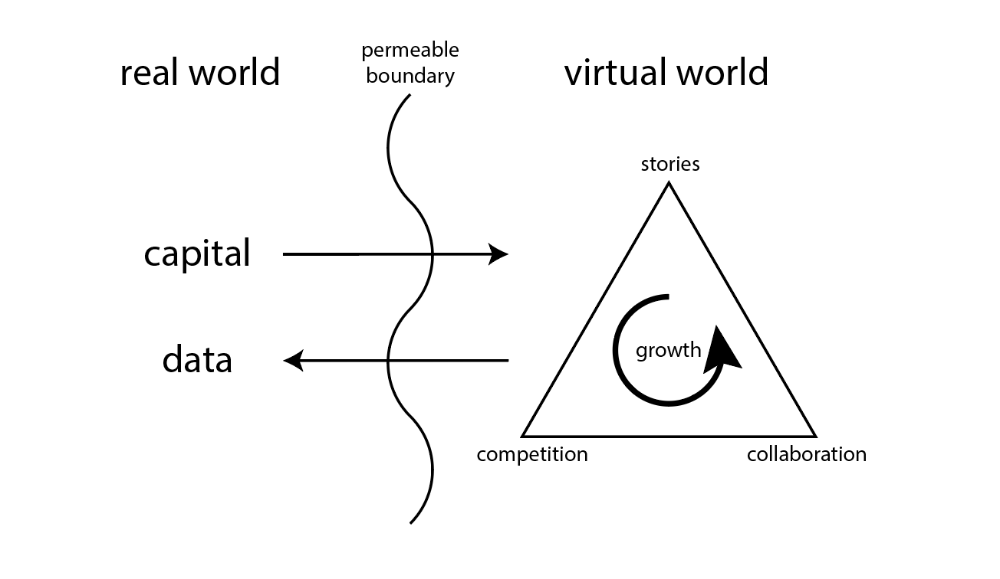
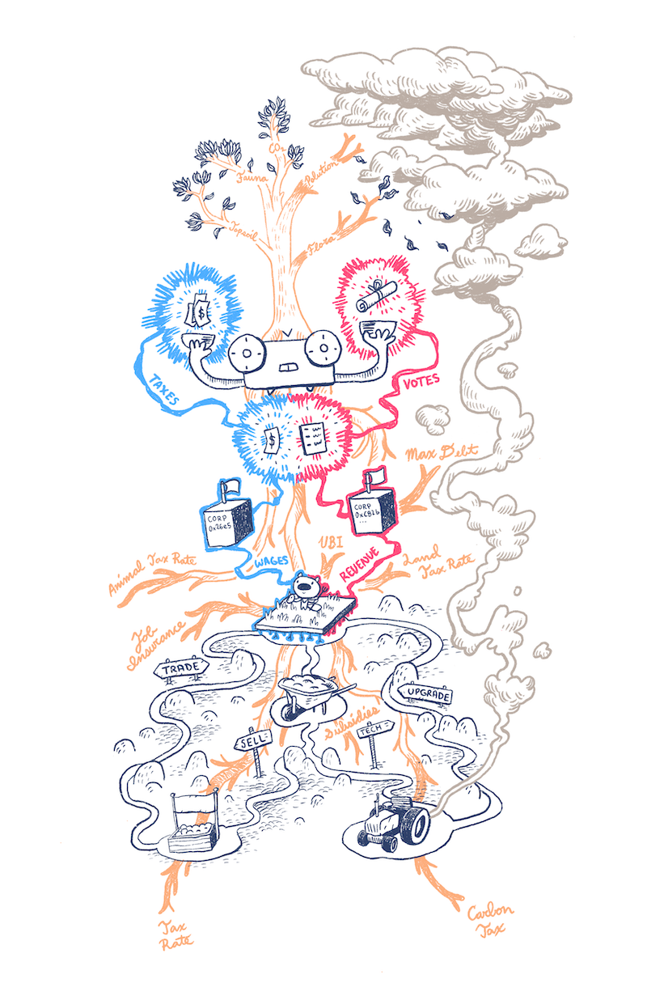

简要总结一下：以世界为中心的设计强调创造动态和有趣世界的游戏机制，而不是服务于玩家体验的游戏机制。例如，下表说明了以世界为中心的常见地方游戏机制版本：

|以玩家为中心的机制 | 以世界为中心的力学|
| :-------------: |:-------------:|
| 补充资源        |   有限的资源     |
| 复兴           | 永久死亡         | 
|   快速旅行      |笛卡尔拓扑（无快速移动）|  
| NPC市场        | 玩家经营的市场   | 

区块链是构建以世界为中心的游戏的理想环境。分权，自主权和法律法规是该平台的基本原则。因此，区块链游戏体验最终是由其代码的新兴现实而非其开发人员的意图所驱动的。

此外，现实世界中的激励因素会驱动玩家做出决策。一级市场和二级市场将公平公正地确定任何游戏资产的价值。因此，以世界为中心的区块链游戏也是动态的虚拟经济。这些经济体在现实世界中可以互换和衡量。

从传统游戏设计的角度来看，区块链游戏中的交易被理解为游戏中的动作。对于播放器而言，该界面不熟悉，昂贵，并且通常来说是不好的体验。相反，我建议将游戏中的行为理解为理性玩家控制的代理商的经济交易。考虑到区块链游戏尚未获得广泛关注的事实，而加密货币交易所每天处理数百万笔交易，这种解释似乎很有希望。

最后，以法定货币为基础的资产，以世界为中心的虚拟世界也可以安全地生成有价值的数据，作为新的激进市场的模型。机制设计仅受开发人员的想象力限制。在这方面，现实世界的价值流入游戏中，而创新的市场驱动叙事则不断涌现。最糟糕的是，这些都是令人兴奋的故事，玩家可以分享。这些经验充其量只能为现实世界的政策提供依据。

从一开始，外部资本就可以将玩家的注意力抵押（可能通过游戏销售，ICO，空投或营销），并引导虚拟世界的经济发展。

通过设置初始状态，玩家可以在虚拟世界中竞争和协作，最终发展其经济并产生价值故事。

这些虚拟世界可以充当新形式的社会组织的游乐场。这些故事可以提供有关新经济机制的宝贵数据。

总之，以世界为中心的区块链游戏的目标是：

1. 创建自我维持的经济体，让参与者竞争和合作以发展出经济驱动的世界叙事。
2. 这些虚拟世界是动态，有趣和有趣的，可供玩家探索。
3. 这些虚拟世界可以安全地为激进市场建模并提供有价值的数据。

## 应用领域

在本节中，我仅重点介绍一些我认为非常适合在以世界为中心的区块链游戏中部署的机制。

* Harberger税：产生更多价值的标记化资产属于Harberger税制，该税制公平地确定其价值并将资源分配给可以最有效地使用它们的人。收入可用于治理，以帮助进一步发展游戏经济。Harberger税制在游戏中的这种直接应用也许也是这里提出的最激进的想法（就像在讨论该想法的《*[激进市场](https://vitalik.ca/general/2018/04/20/radical_markets.html)*》一书中一样），因为它颠覆了许多当前区块链所承诺的永久私有制的概念。游戏。
* [二次投票](https://en.wikipedia.org/wiki/Quadratic_voting)（QV）：最近，QV作为衡量公众利益的一种更有效，更准确的方法而受到了广泛关注。它在链上治理中具有直接的应用，可以用作控制游戏中参数的机制。在“激进市场”一书中也有介绍。我认为在游戏环境中探索QV尤其有用，在这种游戏中，诸如合谋和sybil攻击之类的“漏洞”可能具有新颖的应急方案或实际上是尚未想到的“功能”。
* 环境市场：游戏可以模拟与其经济息息相关的动态环境。环境提供了生产者行为的生产性输出所需的资源，而这些行为又会影响环境。这种模拟本身已经非常有趣，并且可以为我们当前的气候危机提供新的见解。通过QV之类的游戏内治理机制，可以投票（或否决）现实世界的政策（例如碳税或碳排放上限和贸易），并观察其效果。
* 外包劳动力和风险：正如有许多链条一样，将有许多以世界为中心的区块链游戏。每个游戏都会有自己独特的动态经济。可以在两个链之间建立并控制跨游戏的桥梁，从而使每个游戏都可以将劳动力和风险外包给另一个游戏。资本主义，道德和法律的这种抽象减少，可能使我们了解全球经济的现状。
* [Futarchy](https://en.wikipedia.org/wiki/Futarchy)：游戏是有效测试预测管理市场的最佳场所（futarchy）。这特别重要，因为futarchy没有明显的实现方式，并且在假设条件下可以理解（此外，[有效市场假说可](https://en.wikipedia.org/wiki/Efficient-market_hypothesis)确保对概率而不是福祉进行准确的衡量）。

## 现有工作

区块链作为以世界为中心的游戏设计来生成有关新经济机制的数据的游乐场的明确观点是新颖的，但实际上并非如此。每个新链条和ICO交织在一起，是一个复杂，动态和新兴的新关系网，像游戏一样发挥作用。每个链或交易所都是通向其世界的门户。每份白皮书就像一张字符表，概述了组织渴望扮演的角色。每个发烧友，开发商，商人或投资者都是试图在太空中进行协作和竞争的独立代理商。

这就是为什么我有信心以世界为中心的观点是目前游戏建设性地进入区块链领域的最佳角度的原因。如果区块链确实是它声称的范式转移技术，那么其应用本身必须与现有的理解不相称。

## 例

该[PotatoCraft](https://github.com/pdlla/WCBG/blob/master/potatocraft.md)设计文件概述了世界中心blockchain游戏的详细例子。它在其机制中纳入了Harberger税，二次投票和环境市场的变体。鼓励读者扩展这些知识或提出自己的以世界为中心的游戏设计。

最后，我将对PotatoCraft进行高层次的概述，以阐明可能发生的事情的深度和潜力。

