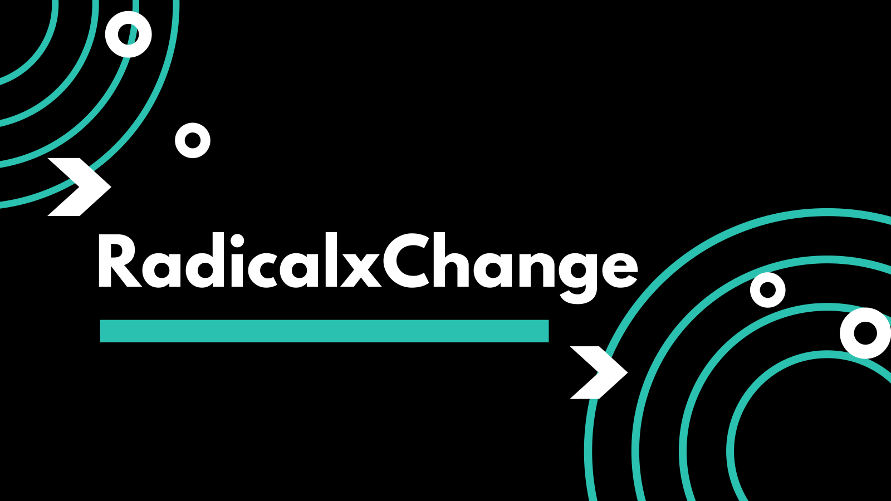

目前席卷全球的COVID-19大流行表明，在全球化背景下，政府和私人行为体应对威胁的机构能力存在重大缺陷。人畜共患病病毒传播的因果机制使人类将来[极易受到](http://nautil.us/issue/83/intelligence/the-man-who-saw-the-pandemic-coming)这些暴发的影响。从扩大的和相互联系的动物供应链推动的肉类消费的大量增加，到每天的全球旅行和高城市密度，我们带来了一种新的常态，在这种常态下，从动物到人类的病毒性传播影响了全人类。

当今世界许多政府所看到的反应是，他们关闭了自己的大门，限制了内部和外部的行动自由。各国正在集中生产和决策，撤消了被认为是这场危机的自由的全球机构。然而，全球机构失灵在COVID-19大流行中起着重要作用的现实，不应使我们把婴儿带上洗澡水。制度上的失败与自由主义和全球价值观的失败不同，必须抵制民族主义和国家对经济的控制。今天采取的正确行动是帮助我们在未来创建一个更加准备的世界，建立社会，经济和流行病学适应力的行动。

在这种情况下，至关重要的是参与机制设计，以制定有助于应对病毒暴发的倡议，确保诸如当前大流行之类的危机不会导致不平等加剧，并确保即使在经济危机时期仍可以进行国际合作全球紧急情况。

## 体制改革

**数据尊严（DD）：DD** 背后的想法是，个人数据不仅是关于世界的固定事实，也不是某人拥有的资本物品，而是[创造性地产生的](https://www.radicalxchange.org/blog/posts/2019-1-5-ydij2t/)东西。结果，与数据相关联的权限需要以一种确认所有数据中都包含的创造价值的方式重新组织。结合[对个人数据](https://www.radicalxchange.org/blog/posts/2019-10-24-uh78r5/)的[交叉性质](https://www.radicalxchange.org/blog/posts/2019-10-24-uh78r5/)的理解，信息不是孤立地涉及个人，而是在重叠和复杂的网络中表示他们之间的关系，可以开发一个框架，使数据在保护个人和社会权利的同时更易于访问。

诸如[数据信任之类的](https://www.cigionline.org/articles/what-data-trust)举措强调了这一理念，即成为个人数据的管理者，并与产生数据的网络合作，以增加讨价还价的能力，同时又返回民主控制。这种对数据的自下而上的控制也体现在台湾应对COVID-19大流行的方法中，该工具[由公民](https://www.csmonitor.com/World/Asia-Pacific/2020/0408/The-web-s-a-threat-to-democracy-Think-again-Taiwan-says)而非政府[构建](https://www.csmonitor.com/World/Asia-Pacific/2020/0408/The-web-s-a-threat-to-democracy-Think-again-Taiwan-says)，以产生高度的社会支持和公众参与。通过提供声音和对公民数据使用的控制，并对为什么需要使用高度透明，可以保持对数据使用的民主同意。

此外，广泛采用DD原理将使数据的价值更加明确，从而使人们为产生经济价值而付出的努力。从用于培训AI算法的在线数据到自愿性数据收集，如今的数据工作者如今已很普遍，从而刺激了政府对COVID-19的响应。开发[使集体谈判](https://www.radicalxchange.org/wp-content/uploads/2020/03/DFA.pdf)能够将部分价值返还给数据劳动者的[框架，](https://www.radicalxchange.org/wp-content/uploads/2020/03/DFA.pdf)不仅可以提供更高的经济安全性，而且可以为共享机构提供更广泛的大众投资。

**拍卖中出售的自我评估许可证（SALSA）：**此外，各州为拯救经济而采取的特殊财政措施将导致对先前私有财产的广泛公共所有权。从股东资本主义到简单的手续费，这代表着一个巨大的机会来重新思考旧有私有财产权制的智慧。政府不应该简单地将这些资产重新引入私人手中，也不应该接受国家主导的经济，而应该尝试使用有效的共有制。

在[SALSA](http://radicalmarkets.com/chapters/property-is-monopoly/)系统中，资产不是永久拥有的，而是根据连续拍卖的许可证持有的。许可证持有人必须声明他们将出售许可证的价格，并针对该自我声明的价格支付财产税。此外，如果有任何买家向他们提供该价格，则他们必须出售。这使稀有财产的持有人向社区缴纳与其专有财产的负外部性成比例的税；并允许在不使用稀有财产以最大程度受益的人的情况下进行公平交易。

与中世纪的费用相比，这是一种更为永久的财产权制度。想象一下，如果州使用这样的系统来管理在破产或纾困之后落入其手中的不动产。当财产权有机地落入公众手中时（如现在正在发生的那样），公众没有任何借口将这些资产回收到17世纪的财产权制度中，而这些制度既不能最大限度地提高效率，也不能保护公众利益。

**二次投票：**的结果[二次投票](https://en.wikipedia.org/wiki/Quadratic_voting)比一个典型的民意调查更有意义，因为那些表达强烈的偏好必须花费语音学分的巨额资金这样做。实时二次投票可以为官员们提供一个有意义的指导，使他们无法权衡不可思议的选择权。[Polco](https://polco.us/n/landing)当前正在构建一个系统，该系统将允许地方官员以这种方式使用二次投票。

我们甚至有一些实践证据证明了二次投票和数字民主国家在这场公共卫生危机中的作用。在由台湾数字部长唐A（Audrey Tang）主持的年度总统黑客马拉松比赛中，台湾参与了基于二次投票的项目评审过程，吸引了超过1000万公民。另外，使用相同的数字民主平台，台湾公民可以发起电子请愿，当项目获得5,000个签名时，公职人员将做出回应。

除公民参与外，二次表决还可能有助于协调议会甚至欧洲联盟或联合国不同机构等国际机构的合作。二次投票将使各国能够团结一致地采取行动，在搭便车和多数人问题的暴政之间进行经济上的最佳权衡。

**二次融资：**[二次融资](https://papers.ssrn.com/sol3/papers.cfm?abstract_id=3243656)是一种新颖的配对基金设计，通过对小额捐款的重视程度超过对大额捐款的投入来鼓励广泛的参与。该机制以类似于二次投票的二次公式为根，可确保对捐助者的经济最优激励。

Gitcoin现在正在这样做–利用二次融资来对抗COVID-19。您可以在这篇简短的[博客文章中](https://www.radicalxchange.org/blog/posts/gitcoin-fighting-covid-19-with-quadratic-finance/)找到有关此项目的更多信息。尽管Gitcoin接受加密货币作为捐赠，但基于本国货币的二次金融系统可能会加速在此特定危机中的采用，从而使公共物品的资金更加独立，例如[病毒研究计划](https://science.sciencemag.org/content/359/6378/872.summary)。

二次融资可以应用于不同的规模。国际政府机构可以使用它来分配预算并推动其成员的额外捐款。对于国家机构，私营部门和更分散的系统而言，情况也是如此-机会很多。在像这样的人道主义危机中，改善资金激励措施和相应的决策至关重要。

**激进的反托拉斯法：**各行各业的[竞争](https://papers.ssrn.com/sol3/papers.cfm?abstract_id=3489965)都在[下降](https://papers.ssrn.com/sol3/papers.cfm?abstract_id=3489965)，压低工人工资，降低提供的服务质量，同时提高价格。这种趋势的主要驱动力之一是机构投资者相对于散户投资者的权力增强，他们有更大的动力去协调公司的幕后活动。在危机时期，由于经济冲击降低了公司的价值，一小部分参与者更愿意利用低迷的机会，从而加剧了集中化的趋势。随着救助计划的发布，而不是分散在整个经济中，它们最终排在少数人的腰包中。长期的后果超出了经济上的危害，因为目前在COVID-19中部缺乏医疗用品可能是由于[医疗市场集中](https://mattstoller.substack.com/p/how-bad-antitrust-enforcers-kill?token=eyJ1c2VyX2lkIjoyNTQ1MjIxLCJwb3N0X2lkIjozNDI0MjMsIl8iOiJIMFI4eSIsImlhdCI6MTU4NjgwMzQ0NCwiZXhwIjoxNTg2ODA3MDQ0LCJpc3MiOiJwdWItMTE1MjQiLCJzdWIiOiJwb3N0LXJlYWN0aW9uIn0.O5TPDPLXsm8gqxAT-n5pBoHhP_CDqpHt4wsG2fnrIds)。

通过限制一个行业中他们可以拥有大量股份的公司数量来限制[机构投资者](https://papers.ssrn.com/sol3/papers.cfm?abstract_id=2872754)的[权力](https://papers.ssrn.com/sol3/papers.cfm?abstract_id=2872754)，将在帮助创建更灵活，更脆弱的经济中发挥重要作用。通过“ [分散](http://radicalmarkets.com/chapters/dismembering-the-octopus/)集中所有制结构[的章鱼](http://radicalmarkets.com/chapters/dismembering-the-octopus/) ”，可以减少经济低迷时期过度并购带来的风险，从而将危机中从多方向少方重新分配的风险降到最低。

## 含义

**病毒抵御能力：**当前的大流行揭示了数据在有效决策和政策应对中的核心地位。从预警系统（例如在世界卫生组织之前检测到[COVID-19爆发的](https://www.wired.com/story/ai-epidemiologist-wuhan-public-health-warnings/)蓝点AI流行病学家）到[新加坡和台湾](https://www.city-journal.org/covid-19-and-technology)等地采用的合同追踪方法，事实证明技术是我们的最佳选择之一针对病毒爆发的防御措施。

但是，政府和医学界使用的数据通常是敏感的，因此，制定不良的数据治理协议会涉及很多风险。正如我们在[中国和韩国](https://lincolnpolicy.org/2020/04/06/how-east-asian-countries-are-using-technology-to-contain-covid-19/)所看到的那样，在危机时期通过紧急权力授予的数据访问存在侵犯公民隐私和缝制公众不信任的风险。鉴于医疗数据不仅具有描述性，而且具有预测性，因此失去公众的支持会危及在平静的情况下有效开发应对技术以准备另一场大流行的努力。

数据尊严可以提供一个体制性框架，以允许收集和访问更多数据，从而使决策者可以更有效地进行协调，而无需在公众面前进行末日奔跑。二次融资可以帮助动员公民资助的计划来应对病毒性威胁，例如[PEPP-PT](https://www.pepp-pt.org/)，该公司正在建立一种泛欧洲的隐私保护邻近跟踪方法，旨在在不损害敏感信息的情况下建立联系人跟踪数据。这种方法了解个人数据和社交网络的本质，其运作方式首先是寻求对个人权利的回应，并将公民视为指导公共卫生工作的参与者。采用RadicalxChange机制将使其中更多的计划蓬勃发展，从而改善大流行病的监测和应对。

**经济稳定：**危机时期的后果是，它们经常导致经济重组，从而有利于人脉发达，却以普通民众为代价。我们已经看到了对行业的大规模救助，将大型公司绑在了离政府更近的地方，并且有[私募股权公司希望收购受重创企业的](https://www.euromoney.com/article/b1l0r609mm870v/private-equity-can-be-the-big-winner-from-covid-19-sell-off)信号。，从整个行业的崩溃中获利。这些活动的长期影响是国家对经济的更大控制和/或更私人经济权力的集中以及不平等的加剧。有了更强大的反托拉斯学说，危机的这种负面长期后果将得到减轻。此外，SALSA机制将提高在低迷时期资产流转的效率，允许进行更多的小额交易，从而减少了将所有资产移交给国家或已经占主导地位的破产破产程序的需要公司。

危机不仅倾向于集中权力，而且其危害由经济安全性较差的低收入家庭过多地承担。尽管在金融或咨询部门从事知识经济工作的个人可以免受社会疏离带来的经济影响，但就业状况不稳定或从事高水平服务工作的人[面临更大的风险](https://coronavirus.jhu.edu/from-our-experts/the-unequal-cost-of-social-distancing)彻底摧毁他们的财务安全。他们失业的时间越长，他们重新进入劳动力队伍就越困难。进一步集中会带来双重打击，关闭劳动力市场并降低劳动力的讨价还价能力。在2008年金融危机之后看到的这些趋势损害了经济复原力，并使人们对未来的大流行更加敏感。诸如DAL之类的方法有助于提高那些即使在不工作的情况下仍然有价值的数据的议价能力。随着COVID-19大流行加速[自动化技术](https://www.nytimes.com/2020/04/10/business/coronavirus-workplace-automation.html)的[采用](https://www.nytimes.com/2020/04/10/business/coronavirus-workplace-automation.html)，充分补偿数据工作人员已成为确保经济安全的重要方法。

**国际合作：**在当前的大流行中，限制旅行和支持国内产业的需求助长了政策制定中的理性主义。尽管确保国内安全至关重要，但没有有效的国际协调与合作是不可能的。由于难以完全关闭边界和退出国际供应链，已经有报道称[COVID-19](https://www.straitstimes.com/singapore/health/most-workplaces-to-close-schools-will-move-to-full-home-based-learning-from-next)在一些地方可以有效地内部抑制该病毒的[死灰复燃](https://www.straitstimes.com/singapore/health/most-workplaces-to-close-schools-will-move-to-full-home-based-learning-from-next)。将流行病视为真正的全球性问题，而不是一味地为实现安全而加倍努力，至关重要的是，各国出于自私和利他理由相互支持，以制定有效的对策至关重要。

二次投票为协调国际政策决策提供了一种理想的机制，允许来自不同利益相关者团体的代表以自下而上和协作的方式表达他们的关切。另外，DD原理可以帮助建立数据基础结构，允许[个人以](https://papers.ssrn.com/sol3/papers.cfm?abstract_id=3375436)可验证的和隐私保护的方式[共享信息](https://papers.ssrn.com/sol3/papers.cfm?abstract_id=3375436)，这可能有助于了解谁有疾病，谁没有疾病。如果发生另一种大流行，这可能使出行限制不太严厉。

## 结论

我们的世界是相互联系的。这带来了无数的好处，从更大的经济机会到消除曾经使人们分离的文化障碍。但是，如果治理不善，那么相互联系的世界将为夺走生命并摧毁经济的流行病提供沃土。与其谴责我们彼此之间的依存关系，不如承认我们相互依存的本质，并建立在危机时期增强声音和合作的机构。如果民主政体旨在阻止沦落为专制政体，那么我们无力应对危机是失败的。

RadicalxChange在增强抵御社会和经济动荡的能力方面发挥着作用。我们与之合作的想法基于对我们个人，政治和经济生活的社会本质的深刻理解，旨在增强公众的参与，合作和信任。尽管我们的解决方案确实是激进的，但正如正在进行的众多小规模实施所示，它们并非不切实际。即使在整个社会范围内，重组也不需要花费一般的时间，就目前的危机而言，台湾的治理能力证明了这一点。犹豫不决不能成为在COVID-19或任何未来的病毒爆发中造成体制薄弱的原因，必须采取行动限制公民，特别是最脆弱人群的社会，经济和政治负担。